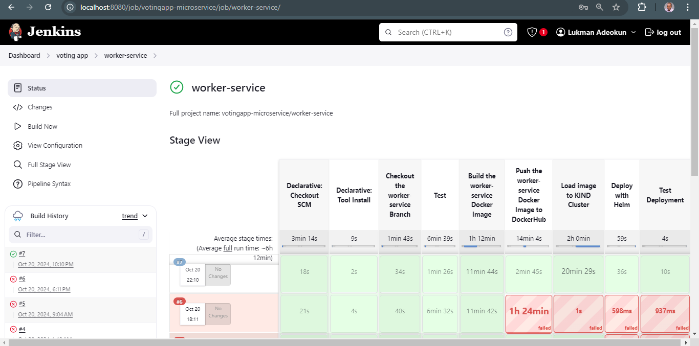

# Worker Service - Voting App Microservice

This `worker-service` is a key component of the Voting App Microservice, responsible for syncing votes from Redis (an in-memory data store) to PostgreSQL (a relational database). The votes are initially stored in Redis and periodically synced to PostgreSQL using this service. The service is deployed in a Kubernetes cluster using [KIND (Kubernetes in Docker)](https://kind.sigs.k8s.io/).

## Features
- Sync votes (for "cats" and "dogs") from Redis to PostgreSQL.
- Automatically creates a `votes` table in PostgreSQL, if it doesn't exist.
- Responds to `POST` requests on the `/sync` endpoint to trigger the synchronization process.

## Code Overview

### `main.go`

- **Redis Initialization**: The service initializes a connection to Redis using the provided address.
- **PostgreSQL Initialization**: The service connects to PostgreSQL, checks if the `votingdb` exists, and creates it if it doesn't. It also creates a `votes` table if it is not present.
- **Sync Handler**: The `/sync` handler retrieves the votes from Redis and updates the PostgreSQL `votes` table. It uses an upsert operation (`ON CONFLICT`) to ensure that votes are updated if already present.

## Prerequisites

Ensure the following tools and platforms are installed and configured:
1. **Docker** - Used for containerizing the services.
2. **Kubernetes** - KIND is used to create a local Kubernetes cluster.
3. **Helm** - For deploying the application using charts.
4. **PostgreSQL** and **Redis** - Both services are used for storage in the microservice.

## Environment Variables
The service uses environment variables for configuration, loaded via a `.env` file. The following variables must be set in the `.env` file (or inline in the code as placeholders):
- `POSTGRES_HOST`: Hostname of the PostgreSQL instance.
- `POSTGRES_USER`: Username for PostgreSQL access.
- `POSTGRES_PASSWORD`: Password for PostgreSQL.
- `POSTGRES_DB`: The default PostgreSQL database.
- `POSTGRES_DB_NEW`: The database where votes are stored (`votingdb`).
- `REDIS_ADDR`: The Redis instance address.

## How to Deploy the Worker Service to a KIND Kubernetes Cluster

### Step 1: Build the Docker Image
First, build the Docker image for the worker service:
```bash
docker build -t lukmanadeokun31/worker-service:latest .
```

### Step 2: Load the Image into KIND
Push the image into the KIND cluster:
```bash
kind load docker-image lukmanadeokun31/worker-service:latest
```

### Step 3: Deploy with Kubernetes YAML
The worker service is deployed into the cluster using Kubernetes manifests (YAML files). Here's an example `worker-service.yaml` file for the deployment and service:

```yaml
apiVersion: apps/v1
kind: Deployment
metadata:
  name: worker
spec:
  replicas: 1
  selector:
    matchLabels:
      app: worker
  template:
    metadata:
      labels:
        app: worker
    spec:
      containers:
      - name: worker-service
        image: lukamnadeokun31/worker-service:latest
        ports:
        - containerPort: 8084
        env:
        - name: REDIS_ADDR
          value: "redis:6379"
        - name: POSTGRES_HOST
          value: "postgres"
        - name: POSTGRES_USER
          value: "postgres"
        - name: POSTGRES_PASSWORD
          value: "yourpassword"
        - name: POSTGRES_DB
          value: "postgres"
        - name: POSTGRES_DB_NEW
          value: "votingdb"
---
apiVersion: v1
kind: Service
metadata:
  name: worker-service
spec:
  type: ClusterIP
  selector:
    app: worker-service
  ports:
    - protocol: TCP
      port: 8084
      targetPort: 8084
```

Apply the YAML file to deploy the service in Kubernetes:
```bash
kubectl apply -f worker-service.yaml
```

### Step 4: Expose the Worker Service (Optional)
To access the service externally (if necessary), you can expose it via a NodePort:
```bash
kubectl expose deployment worker-service --type=NodePort --port=8084
```

### Step 5: Verify the Deployment
Check if the worker-service pod is running correctly:
```bash
kubectl get pods
```

Once the pod is running, the service will be available and ready to sync votes via the `/sync` endpoint.

## Endpoints

- **`/sync`** (POST): This endpoint triggers synchronization of votes from Redis to PostgreSQL.

### Example Request
```bash
curl -X POST http://localhost:8084/sync
```

This will fetch vote counts from Redis and update them in the PostgreSQL database.


## Automated Deployment of worker-service
* Create Jenkinsfile in the root directory of the worker-service branch
* Include the necessary stages needed to automate the deployment of the worker-service
* Build the worker-service branch from the jenkins server




## Monitoring and Logging

The service logs the steps of the sync process, including:
- Retrieval of votes from Redis.
- Connection status with PostgreSQL.
- Success or failure of vote syncing.

Logs are available via `kubectl logs`:
```bash
kubectl logs <worker-service-pod-name>
```

## Helm Chart Deployment

You can automate the deployment using Helm charts. Customize a `values.yaml` file for the worker-service and use the following commands:

```bash
helm install worker ./worker-charts -f ./worker-chart/values.yaml
```

## Conclusion

The `worker-service` plays a critical role in syncing vote counts from the in-memory Redis store to the persistent PostgreSQL database, ensuring data consistency. This service can be deployed and scaled within the Kubernetes cluster, making it a reliable part of the Voting App Microservice.

