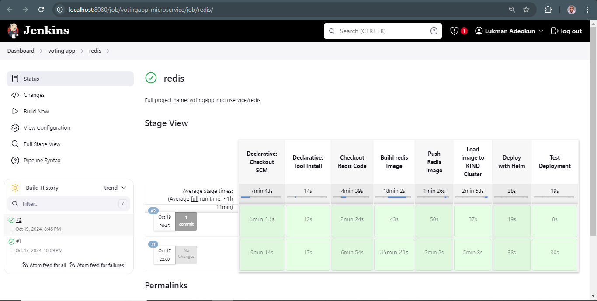
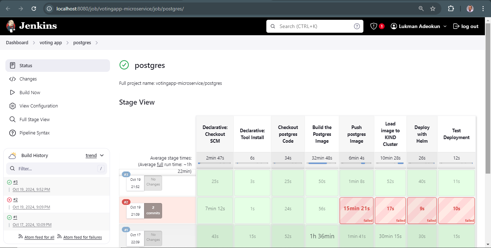
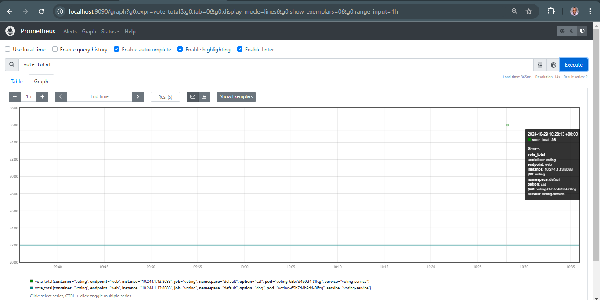
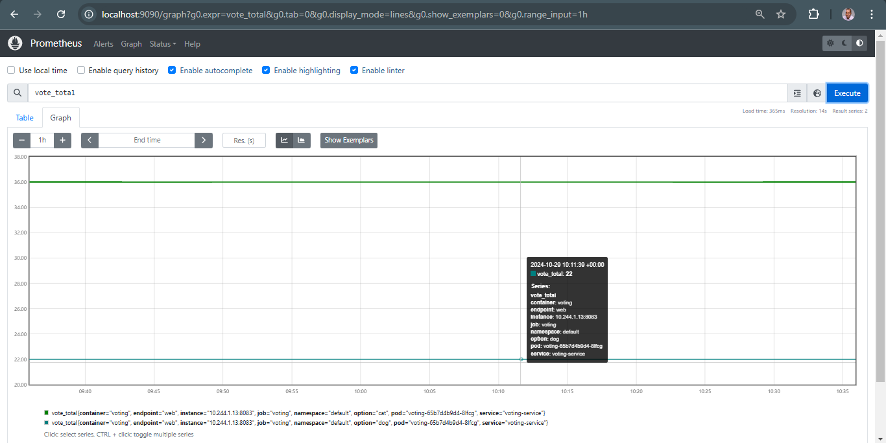
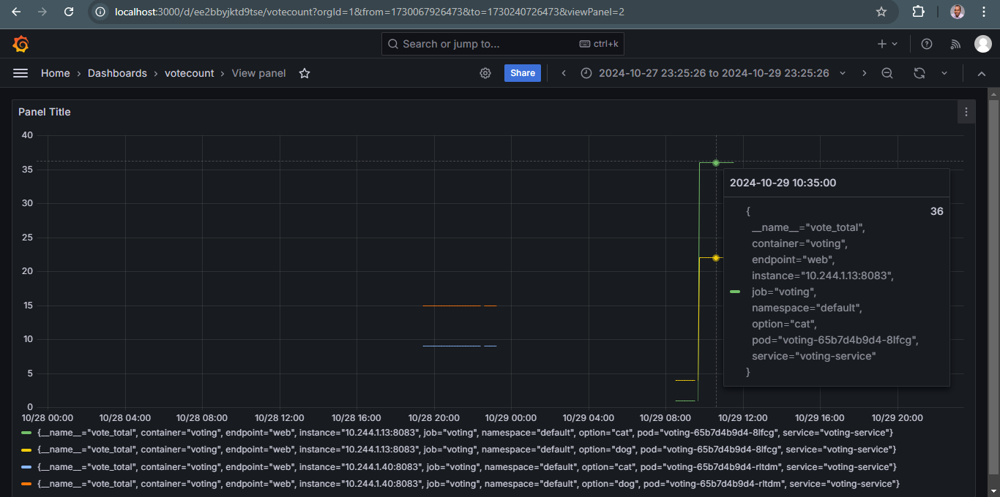
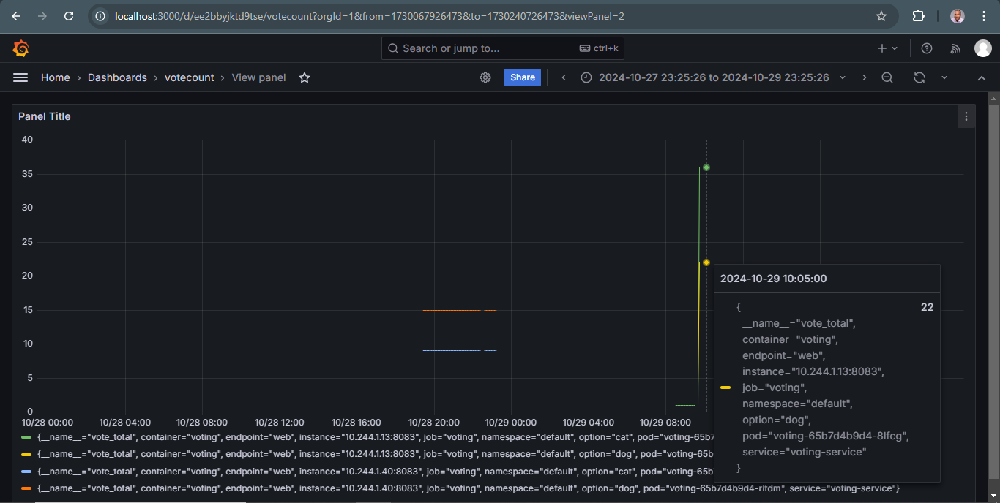

# Golang Microservice Voting Application with CI/CD, Kubernetes, Monitoring, and Logging

## Table of Contents
- [Overview](#overview)
- [Features](#features)
- [Prerequisites](#prerequisites)
- [Setup](#setup)
  - [Environment Configuration](#environment-configuration)
  - [Architecture and Dataflow](#architecture-and-dataflow)
  - [Helm Setup and Installation](#helm-setup-and-installation)
  - [Monitoring with Prometheus and Grafana](#monitoring-with-prometheus-and-grafana)
- [Service Details](#service-details)
- [Running the Services](#running-the-services)
- [Containerization and Docker Setup](#containerization-and-docker-setup)
- [Automated Orchestration with Jenkins](#automated-orchestration-with-jenkins)
- [Design Choices](#design-choices)
- [Repository Structure](#repository-structure)
- [Troubleshooting](#troubleshooting)
- [Notes](#notes)

## Overview
This repository contains a microservice-based voting application written in Go. It is a multi-branch repo containing 
a **redis branch**, **postgres branch**, **voting-service branch**, **worker-service branch** and a **results-service branch**. 

Each branch of this repository represents a component of the application.The application allows users to vote for either cats or dogs, processes these votes in real-time, and displays the results. The setup uses Jenkins for CI/CD, Kubernetes for orchestration, Helm for deployment management, and monitoring via Prometheus and Grafana, with logging provided by the ELK stack.

### Microservices Overview
- **Voting Service:** Manages user voting.
- **Worker Service:** Syncs votes from Redis to PostgreSQL.
- **Results Service:** Displays vote results from PostgreSQL.

## Features
- **CI/CD:** Automated with Jenkins.
- **Kubernetes Deployment:** Orchestration of services.
- **Monitoring:** Prometheus for metrics scraping and Grafana for visualization.
- **Logging:** ELK stack for log management and analysis.
- **Autoscaling:** Handles increased traffic with Kubernetes HPA (Horizontal Pod Autoscaler).

## Prerequisites
Ensure the following dependencies are installed:
- **Go 1.18** or later
- **Redis** for in-memory data storage
- **PostgreSQL** for persistent vote storage
- **Docker** for containerization
- **Jenkins** for CI/CD pipeline automation
- **Kubernetes** for container orchestration
- **Docker Desktop** for local containerization
- **Kubernetes in Docker (KIND)** for managing Kubernetes clusters
- **Helm** for Kubernetes deployment management
- **Prometheus & Grafana** for monitoring and alerting
- **ELK Stack** (Elasticsearch, Logstash, Kibana) for logging

## Setup

### Environment Configuration
Each service requires environment variables stored in `.env` files. Example `.env` files are provided in the respective service directories.

### Architecture and Dataflow of the Application


1. User votes for either a cat or a dog.
2. The vote is stored in Redis.
3. A background worker syncs votes from Redis to PostgreSQL.
4. The results service reads from PostgreSQL to display voting results.
5. **Monitoring:** Prometheus scrapes metrics from the services, and Grafana provides visualization.
6. **Logging:** ELK stack captures logs from the services.

### Helm Setup and Installation
Helm is used to deploy the application to the Kubernetes cluster. Ensure Helm is installed, then follow these steps:

1. **Initialize Helm:**  
   ```bash
   helm init
   ```

2. **Create a Helm Chart for Each Service:** Each branch/service (voting-service, worker-service, results-service, Redis, PostgreSQL) should have a Helm chart in the `charts/` directory.

3. **Deploy Services using Helm:**  
   ```bash
   git checkout redis
   helm install redis ./redis-chart

   git checkout postgres
   helm install postgres ./postgres

   git checkout voting-service
   helm install voting ./voting-chart

   git checkout worker-service
   helm install worker ./worker-chart

   git checkout results-service
   helm install results ./results-chart
   ```

4. **Verify Installation:**
   ```bash
   kubectl get all
   ```

### Monitoring with Prometheus and Grafana
Prometheus and Grafana are used for monitoring and visualization. 

1. **Install Prometheus and Grafana:**
   * Download and deploy the kube-prometheus-stack Helm chart.
   ```bash
     helm repo add prometheus-community https://prometheus-community.github.io/helm-charts
     helm repo update
     helm install prometheus prometheus-community/kube-prometheus-stack
   ```

2. **Configure Service Monitoring:**
   - Set up a `ServiceMonitor` resource for each service to allow Prometheus to scrape metrics. This can be added in the Helm chart for each service.

3. **Access Grafana Dashboard:**
   - Retrieve the Grafana password:
     ```bash
     kubectl get secret --namespace default grafana -o jsonpath="{.data.admin-password}" | base64 --decode
     ```
   - Port forward Grafana to access it locally:
     ```bash
     kubectl port-forward service/grafana 3000:3000
     ```
   - Open Grafana at `http://localhost:3000` and log in with the retrieved password.

## Service Details
Each service is explained below with its main functionality, port, and routes.

### Voting Service
- **Port:** 8083
- **Routes:**
  - `GET /`: Displays the voting page.
  - `POST /vote/cat`: Increments the cat vote.
  - `POST /vote/dog`: Increments the dog vote.

### Worker Service
- **Port:** 8084
- **Route:**
  - `POST /sync`: Syncs vote counts from Redis to PostgreSQL.

### Results Service
- **Port:** 8085
- **Route:**
  - `GET /results`: Displays current vote counts from PostgreSQL.

## Running the Services
1. **Start Redis:**
   ```bash
   redis-server
   ```

2. **Start PostgreSQL:** Ensure the PostgreSQL service is running and accessible.

3. **Run Services:** Navigate to each service's directory and run:
   ```bash
   go run main.go
   ```

4. **Access the Services:**
   - Voting Service: `http://localhost:8083`
   - Worker Service: `http://localhost:8084`
   - Results Service: `http://localhost:8085`

### voting-service


### results-service


## Containerization and Docker Setup
Dockerfiles are used for each service, with a `docker-compose.yml` file for multi-container setup.

1. **Docker Network:**
   ```bash
   docker network create my-voting-app-network
   ```

2. **Start Services with Docker Compose:**
   ```bash
   docker-compose up -d
   ```

## Automated Container Orchestration in KIND using Jenkins

The CI/CD pipeline automates the deployment of each service from its respective branch into the KIND cluster. Each branch represents one of the microservices, and Jenkins automates:

* Checking out code from GitHub.
* Running tests.
* Building Docker images.
* Pushing images to Docker Hub.
* Deploying to the KIND cluster.
* Steps to Automate with Jenkins:

First , the KIND cluster automatically generates certificates and keys for authentication between the client (e.g., kubectl) and the cluster's API server

* Copy the values of the certificate-authority-data,client-certificate-data and client-key-data from the KIND cluster  and encode into base64

* Update the kubeconfig.yaml file with these values

* Upload the kubeconfig.yaml file as a credential file to jenkins

* Set up SSH access between Jenkins and your GitHub repository.
* Add Docker Hub credentials to Jenkins.
* Configure pipelines for each service (voting-service, worker-service, results-service, Redis, PostgreSQL) by creating a jenkinsfile in the root directory of each branch.
* Automate deployment for pipeline using kubectl and Helm.

### redis pipeline


### postgres pipeline


### voting-service pipeline


### worker-service pipeline


### results-service pipeline


###  votingapp microservice


### Cat metrics


### Dog metrics


### Cat metrics visualisation


### Dog metrics visualisation



## Design Choices
- **Microservice Architecture:** Each service is independently deployable.
- **Autoscaling:** Kubernetes Horizontal Pod Autoscaler (HPA) ensures efficient handling of increased traffic.
- **Monitoring & Logging:** Prometheus, Grafana, and the ELK stack provide a comprehensive solution for monitoring and logging.

## Repository Structure
- `static/`: Contains static assets such as CSS and images.
- `images/`: Holds images like the microservice architecture diagram.
- `voting-service/`: Handles user input and vote submission.
- `worker-service/`: Processes and syncs votes from Redis to PostgreSQL.
- `results-service/`: Retrieves and displays vote counts from PostgreSQL.
- `go.mod`: Defines the Go module and its dependencies.
- `docker-compose.yml`: Streamlines container orchestration.

## Troubleshooting
- **Database Connection Errors:** Verify PostgreSQL is running and the credentials in `.env` are correct.
- **Redis Connection Issues:** Ensure Redis is running and accessible at the specified address.

## Notes
- Ensure all environment variables are correctly set before running the services.
- Adjust configuration (e.g., Redis and PostgreSQL addresses) in `.env` files as needed.