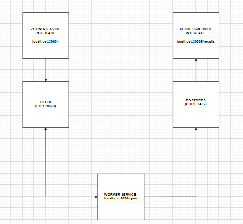
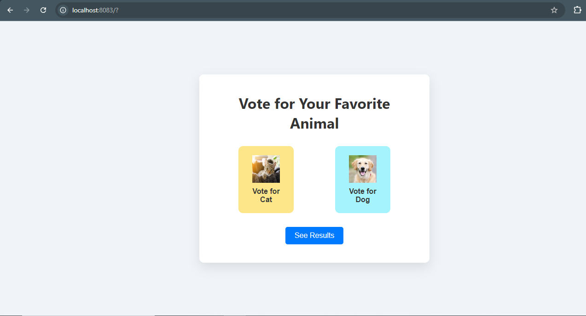
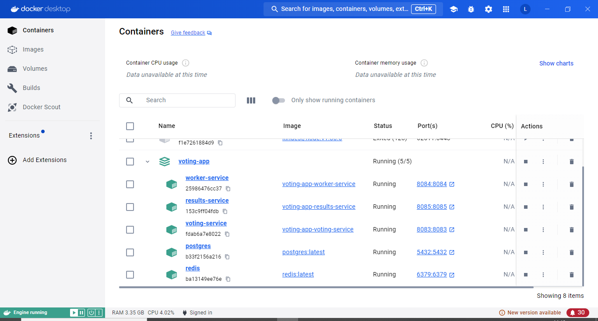
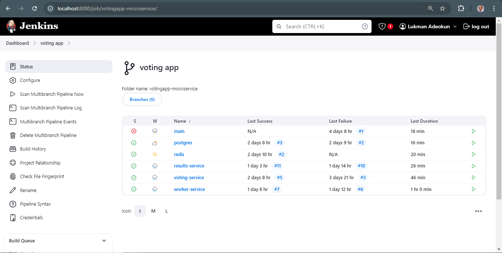

# Golang Microservice Voting Application with CI/CD, Kubernetes, Monitoring, and Logging

## Table of Contents
- [Overview](#overview)
- [Features](#features)
- [Prerequisites](#prerequisites)
- [Setup](#setup)
  - [Environment Configuration](#environment-configuration)
  - [Architecture and Dataflow](#architecture-and-dataflow)
  - [Initialize Redis](#initialize-redis)
  - [Initialize PostgreSQL Database](#initialize-postgresql-database)
- [Service Details](#service-details)
  - [Voting Service](#voting-service)
  - [Worker Service](#worker-service)
  - [Results Service](#results-service)
- [Running the Services](#running-the-services)
- [Containerization and Docker Setup ](#containerization-and-docker-setup)

- [Design Choices](#design-choices)
- [Repository Structure](#repository-structure)
- [Troubleshooting](#troubleshooting)
- [Notes](#notes)

## Overview
This repository contains a microservice-based voting application written in Go (Golang). Each branch of this repository represnts a component of the application.The application allows users to vote for either cats or dogs. It then processes these votes in real-time, and displays the results. 

The deployment of the application uses CI/CD with Jenkins, container orchestration with Kubernetes, monitoring with Prometheus and Grafana, and logging with the ELK stack (Elasticsearch, Logstash, and Kibana).

### Microservices Overview
- **Voting Service:** Manages user voting.
- **Worker Service:** Syncs votes from Redis to PostgreSQL.
- **Results Service:** Displays vote results from PostgreSQL.

## Features
- **CI/CD:** Automated with Jenkins.
- **Kubernetes Deployment:** Orchestration of services.
- **Monitoring:** Prometheus for metrics scraping and Grafana for visualization.
- **Logging:** ELK stack for log management and analysis.
- **Autoscaling:** Handles increased traffic with Kubernetes HPA (Horizontal Pod Autoscaler).

## Prerequisites
Ensure the following dependencies are installed:
- **Go 1.18** or later
- **Redis** for in-memory data storage
- **PostgreSQL** for persistent vote storage
- **Docker** for containerization
- **Jenkins** for CI/CD pipeline automation
- **Kubernetes** for container orchestration
- **DockerDesktop** for local containerisation
- **Kubernetes in Docker(KIND)** for kubernetes clusters management


- **Prometheus & Grafana** for monitoring and alerting
- **ELK Stack** (Elasticsearch, Logstash, Kibana) for logging

## Setup

### Environment Configuration
Each service requires environment variables, which are stored in `.env` files. Example `.env` files are provided in the respective service directories.

#### Sample `.env` Files
- `voting-service/.env`
- `worker-service/.env`
- `results-service/.env`

### Architecture and Dataflow of the Application


1. The user votes for either a cat or a dog.
2. The vote is stored in Redis, an in-memory data store.
3. A background worker service reads from Redis and updates the vote count in PostgreSQL.
4. The results service reads from PostgreSQL and displays the voting results via a web interface.
5. **Monitoring:** Prometheus scrapes metrics from the services, and Grafana provides visualization.
6. **Logging:** ELK stack captures logs from the services.

### Initialize Redis
- Ensure Redis is installed and running.
- Redis stores vote counts before they are synced to PostgreSQL.

### Initialize PostgreSQL Database
- Ensure PostgreSQL is installed and running.
- The services will automatically create the necessary tables in the PostgreSQL database if they don't exist.

## Service Details

### Voting Service
- **Port:** 8083
- **Routes:**
  - `GET /`: Displays the voting page.
  - `POST /vote/cat`: Increments the cat vote.
  - `POST /vote/dog`: Increments the dog vote.
  
#### Main Functions:
- Connects to Redis for vote storage.
- Provides endpoints for user voting.
- Notifies the worker service after each vote is cast.

### Worker Service
- **Port:** 8084
- **Route:**
  - `POST /sync`: Receives vote counts from Redis and syncs them to PostgreSQL.

#### Main Functions:
- Connects to Redis and PostgreSQL.
- Synchronizes vote counts from Redis to PostgreSQL.

### Results Service
- **Port:** 8085
- **Route:**
  - `GET /results`: Displays current vote counts from PostgreSQL.

#### Main Functions:
- Connects to PostgreSQL to retrieve vote counts.
- Renders the results page.

## Running the Services

1. **Start Redis:**
   ```bash
   redis-server
   ```

2. **Start PostgreSQL:** Ensure the PostgreSQL service is running and accessible.

3. **Run Services:** Navigate to each service's directory and run:
   ```bash
   go run main.go
   ```

4. **Access the Services:**
   - Voting Service: `http://localhost:8083`
   - Worker Service: `http://localhost:8084`
   - Results Service: `http://localhost:8085`


  ### voting-service



### results-service


## Containerization and Docker Setup

To containerize the application, Dockerfiles are used for each service, and a `docker-compose.yml` file can manage the multi-container setup.

1. **Docker Network:**
   Create a custom network:
   ```bash
   docker network create my-voting-app-network
   ```

2. **Start Services:**
   Use Docker Compose to build and run the containers:
   ```bash
   docker-compose up -d
   ```

  

3. **Handling PostgreSQL Delays:**
   To prevent connection errors during startup, delay the worker and results services:
   ```yaml
   worker-service:
     entrypoint: sh -c "sleep 10 && ./worker-service"
   results-service:
     entrypoint: sh -c "sleep 10 && ./results-service"
   ```


### Microservice in Docker Desktop after running the cmd  `docker-compose up -d` in the terminal


## Container Orchestration using Kubernetes
With each service dockerised, the next step is to load into a kubernetes cluster.
Kubernetes in Docker(KIND) was used to achieve this
* Kind was installed
* Kind cluster was created with a config file(for networking) that exposes Nodeport for the voting-service and resesults-service using the command below

``` bash 
kind create cluster --name myvotingapp-microservice --config kind-config.yaml  
```
 
* Load the 5 images into the KIND cluster using the command below
``` bash
  * kind load docker-image redis:latest --name    votingapp-microservice

  * kind load docker-image voting-service:latest --name votingapp-microservice

  * kind load docker-image postgres:latest --name votingapp-microservice

  * kind load docker-image results-service:latest --name votingapp-microservice

  * kind load docker-image worker-service:latest --name votingapp-microservice
```

* Deployed the redis pod,redis service, voting-app pod,voting-app service, postgres pod, postgres service,results pod, results service, worker pod, worker service 

``` bash
* kubectl create -f redis-pod.yaml
* kubectl create -f redis-service.yaml

* kubectl create -f voting-app-pod.yaml
* kubectl create -f voting-app-service.yaml

* kubectl create -f postgres-pod.yaml
* kubectl create -f postgres-service.yaml

* kubectl create -f results-app-pod.yaml
* kubectl create -f results-app-service.yaml

* kubectl create -f worker-app-pod.yaml
* kubectl create -f worker-app-service.yaml
```
* Ran the url below in  a browser 
http://127.0.0.1:30004/

## Automated Container Orchestration in KIND using Jenkins

The CI/CD pipeline automates the deployment of each service from its respective branch into the KIND cluster. Each branch represents one of the microservices, and Jenkins automates:

* Checking out code from GitHub.
* Running tests.
* Building Docker images.
* Pushing images to Docker Hub.
* Deploying to the KIND cluster.
* Steps to Automate with Jenkins:

First , the KIND cluster automatically generates certificates and keys for authentication between the client (e.g., kubectl) and the cluster's API server

* Copy the values of the certificate-authority-data,client-certificate-data and client-key-data from the KIND cluster  and encode into base64

* Update the kubeconfig.yaml file with these values

* Upload the kubeconfig.yaml file as a credential file to jenkins

* Set up SSH access between Jenkins and your GitHub repository.
* Add Docker Hub credentials to Jenkins.
* Configure pipelines for each service (voting-service, worker-service, results-service, Redis, PostgreSQL) by creating a jenkinsfile in the root directory of each branch.
* Automate deployment for pipeline using kubectl and Helm.




## Design Choices
- **Microservice Architecture:** The application is divided into loosely coupled services (voting, worker,results, redis and postgres) for scalability and independent deployment.
- **Autoscaling:** Kubernetes Horizontal Pod Autoscaler ensures efficient handling of increased traffic based on CPU usage.
- **Monitoring & Logging:** Prometheus, Grafana, and the ELK stack provide a comprehensive solution for monitoring and logging.


## Repository Structure

- `static/`: Contains static assets such as CSS and images.
- `images/`: Holds images like the microservice architecture diagram.
- `voting-service/`: Handles user input and vote submission.
- `worker-service/`: Processes and syncs votes from Redis to PostgreSQL.
- `results-service/`: Retrieves and displays vote counts from PostgreSQL.
- `go.mod`: Defines the Go module and its dependencies.
- `docker-compose.yml`:  This file  is one that allows one to specify the services, networks e.t.c. that the voting application requires in a single file, streamlining the process of orchestrating multiple Docker containers.
## Troubleshooting

- **Database Connection Errors:** Verify PostgreSQL is running and the credentials in `.env` are correct.
- **Redis Connection Issues:** Ensure Redis is running and accessible at the specified address.

## Notes
- Ensure all environment variables are correctly set before running the services.
- Adjust configuration (e.g., Redis and PostgreSQL addresses) in `.env` files as needed.

