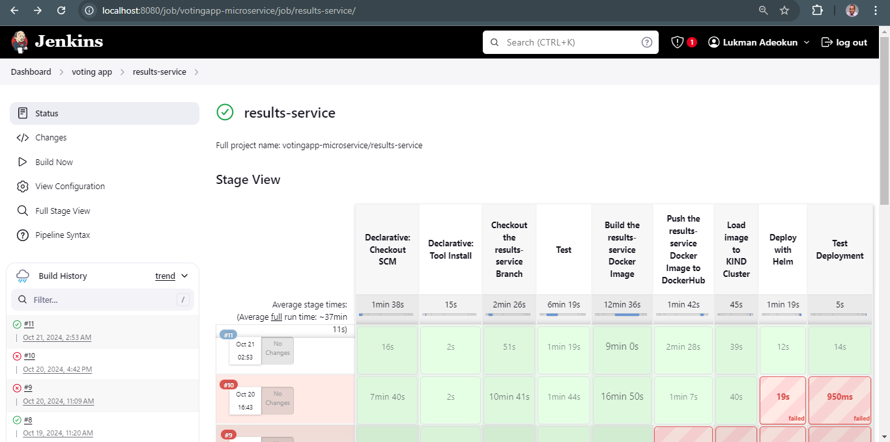

# Results-Service for VotingApp Microservice

This repository contains the **results-service** component of the VotingApp microservice. The results-service displays the current vote counts for the cat vs. dog voting competition, by retrieving the votes from a PostgreSQL database and rendering the results on an HTML page.

## Overview

The results-service:
- Retrieves the vote counts from a PostgreSQL database.
- Displays the results via a `results.html` template.
- Provides a static file server for serving the CSS and other static files.
- Uses environment variables to configure the connection to the PostgreSQL database and the voting service URL.

## Deployment to a KIND Cluster

This guide will walk you through automating the deployment of the results-service into a [KIND (Kubernetes in Docker)](https://kind.sigs.k8s.io/) cluster.

### Prerequisites

1. **KIND Cluster**: Ensure you have a running KIND cluster.
   - Install KIND by following the instructions [here](https://kind.sigs.k8s.io/docs/user/quick-start/).
   - Create a cluster using `kind create cluster`.

2. **Helm**: Make sure Helm is installed to manage Kubernetes deployments.
   - Install Helm by following the instructions [here](https://helm.sh/docs/intro/install/).

3. **Docker**: Ensure Docker is installed and running to build and push Docker images.
   - Install Docker [here](https://docs.docker.com/get-docker/).

4. **PostgreSQL**: The service connects to PostgreSQL, so make sure it's deployed as part of the cluster.

### Steps to Deploy

#### 1. Build and Push Docker Image

You need to build a Docker image for the results-service and push it to Docker Hub (or any container registry).

```bash
# Build the Docker image
docker build -t lukmanadeokun31/results-service:latest .

# Push the image to Docker Hub
docker push lukmanadeokun31/results-service:latest
```

#### 2. Helm Chart for Deployment

Create a Helm chart for the results-service to automate its deployment into the Kubernetes cluster. Ensure the chart specifies the following:
- Container image details.
- PostgreSQL connection details.
- Service configuration to expose the results page.

Example `values.yaml`:

```yaml
image:
  repository: lukmanadeokun31/results-service
  tag: "latest"

service:
  type: NodePort
  port: 8085

postgres:
  host: postgres
  user: postgres
  password: Omowunmi28
  database: votingdb

env:
  VOTING_SERVICE_URL: http://localhost:30004
```

#### 3. Deploy the Results-Service

Use the Helm chart to deploy the results-service into the KIND cluster:

```bash
# Navigate to the Helm chart directory
cd helm/results-service

# Install the Helm chart
helm install results ./results-chart/ -f ./results-chart/values.yaml
```

#### 4. Expose the Results-Service

Once deployed, you can access the results-service by exposing it using a NodePort service:

```bash
# Get the NodePort
kubectl get svc results-service

# Use the port to access the service in your browser
http://localhost:30005/results
```

## Automated Deployment of results-service
* Create Jenkinsfile in the root directory of the results-service branch
* Include the neccessary stages in the Jenkinsfile needed for the automated deployment
* Build the Jenkins pipeline



### Environment Variables

The service uses the following environment variables to connect to the PostgreSQL database and the voting-service URL:
- `POSTGRES_HOST`: The hostname of the PostgreSQL service (default: `postgres`).
- `POSTGRES_USER`: The PostgreSQL username (default: `postgres`).
- `POSTGRES_PASSWORD`: The PostgreSQL password.
- `POSTGRES_DB_NEW`: The database name (default: `votingdb`).
- `VOTING_SERVICE_URL`: The URL of the voting service (default: `http://localhost:30004`).

### Code Structure

- `main.go`: Contains the main logic for connecting to PostgreSQL, handling requests, and rendering the results page.
- `templates/`: Contains the `results.html` file for displaying the vote counts.
- `static/`: Contains CSS files for styling the results page.

### API Endpoints

- `GET /results`: Displays the current vote counts for cats and dogs by querying the PostgreSQL database.


### Contact

For any questions or issues, feel free to open an issue in this repository.

---

This README provides a basic overview of how to automate the deployment of the results-service into a KIND cluster and outlines the key steps involved.