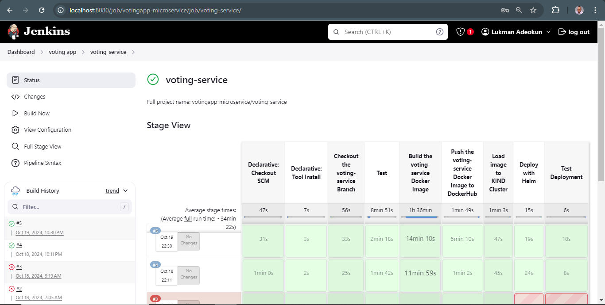

```md
# Voting-Service Component - Voting App Microservice

The `voting-service` is a core component of the Voting App microservice architecture. It handles the HTTP requests for casting votes and temporarily stores the vote counts in Redis. The votes are later synchronized with PostgreSQL by the worker-service.

## Table of Contents

- [Overview](#overview)
- [Architecture](#architecture)
- [Getting Started](#getting-started)
- [Configuration](#configuration)
- [API Endpoints](#api-endpoints)
- [Docker](#docker)
- [Kubernetes Deployment](#kubernetes-deployment)
- [Helm Chart](#helm-chart)
- [Monitoring](#monitoring)
- [License](#license)

## Overview

The voting-service provides users with an interface to vote between two options: cats and dogs. Votes are stored in Redis, which acts as a temporary store, and a worker service later synchronizes these votes with a PostgreSQL database.

### Key Features:
- Cast votes for either cats or dogs.
- Temporary in-memory storage of votes using Redis.
- Communicates with a worker service to sync votes to PostgreSQL.
- Exposes a web interface for voting.

## Architecture

The voting-service interacts with the Redis component to store votes and with the worker-service to notify when votes are updated. It serves a simple web UI built with HTML templates and static CSS files.

```text
+-----------------+     +--------+       +----------------+
| Voting Service  +---> + Redis  +------>+ Worker Service |
+-----------------+     +--------+       +----------------+
    |                                           |
    v                                           v
  (HTML)                                      PostgreSQL
```

- **Voting-Service**: Web UI for voting, processes vote submissions, and stores them in Redis.
- **Redis**: In-memory data store for temporary vote storage.
- **Worker-Service**: Synchronizes votes from Redis to PostgreSQL.

## Getting Started

### Prerequisites

- [Go](https://golang.org/dl/)
- [Redis](https://redis.io/)
- [Docker](https://www.docker.com/)
- [Kubernetes](https://kubernetes.io/) (with [KIND](https://kind.sigs.k8s.io/) or Minikube)
- [Helm](https://helm.sh/)

### Clone the Repository

```bash
git clone https://github.com/AdekunleDally/votingapp-microservice.git
cd votingapp-microservice/voting-service
```

### Running Locally

1. Ensure Redis is running locally or in Docker.
2. Set the `REDIS_ADDR` in the `.env` file to point to your Redis instance.
3. Run the voting service:

```bash
go run main.go
```

The service will be available at [http://localhost:8083](http://localhost:8083).

## Configuration

The `voting-service` can be configured via environment variables stored in a `.env` file:

| Variable             | Description                  | Default Value           |
|----------------------|------------------------------|-------------------------|
| `REDIS_ADDR`         | Redis server address         | `redis:6379`            |
| `RESULTS_SERVICE_URL`| URL for the results service  |`"http://localhost:30005/results"`           |

## API Endpoints

### 1. `GET /`
Renders the voting page, allowing users to vote for cats or dogs.

### 2. `POST /vote/cat`
Records a vote for cats and stores it in Redis.

### 3. `POST /vote/dog`
Records a vote for dogs and stores it in Redis.

## Docker

You can build and run the voting-service locally using Docker.

### Build Docker Image

```bash
docker build -t lukmanadeokun31/voting-service .
```

### Run the Docker Container

```bash
docker run -p 8083:8083 lukmanadeokun31/voting-service
```

## Kubernetes Deployment

The voting-service can be deployed to a Kubernetes cluster using the provided Kubernetes manifest files.

### Deploy to Kubernetes

```bash
kubectl apply -f voting-app-pod.yaml
kubectl apply -f voting-service.yaml
```

### Verify Voting Service Deployment

Check the voting-service pods:

```bash
kubectl get pods -l app=voting-service
```

Check the voting-service:

```bash
kubectl get svc -l app=voting-service
```

## Helm Chart

The voting-service is part of the Helm chart for the entire voting-app microservice.

### Deploy voting-service using Helm Chart

```bash
helm install voting ./voting-chart
```

This will deploy the voting-service into the votingapp-microservice Kubernetes cluster.

## Automated Deployment of Voting-Service 
* Create a Jenkinsfile in the root directory of the voting-service branch.
* Include the neccessary stages needed in the Jenkinsfile
* Log on to jenkins server on localhose:8080  
* Build the Jenkinsfile located in the root directory of the voting-service branch




## Monitoring

The voting-service can be monitored using Prometheus and Grafana as part of the overall monitoring stack for the voting app.

### Prometheus ServiceMonitor

Make sure the Prometheus instance is set up to scrape the voting-service metrics. The metrics can be accessed at:

```bash
<your-prometheus-url>/targets
```

```

### Explanation:
- **Overview**: Describes the role of the voting-service and its interactions.
- **Architecture**: Illustrates the flow and components involved in the voting service.
- **Getting Started**: Instructions for setting up the service locally.
- **Configuration**: Details about environment variables needed for configuration.
- **API Endpoints**: Lists the endpoints exposed by the voting-service.
- **Docker/Kubernetes**: Provides details for Docker and Kubernetes deployments.
- **Helm Chart**: Explains how to deploy using Helm.
- **Monitoring**: Mentions monitoring using Prometheus and Grafana.