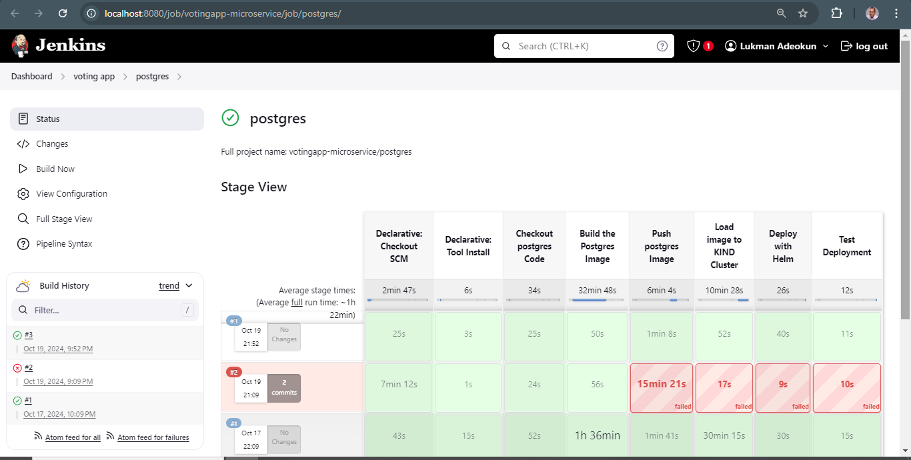

# PostgreSQL Component for VotingApp Microservice

This repository contains the **PostgreSQL** component of the VotingApp microservice, which serves as the primary database for storing the voting data. PostgreSQL holds the votes submitted in the competition between cats and dogs, and the other services (voting-service, results-service, and worker-service) interact with this database.

## Overview

The PostgreSQL component:
- Stores voting data from the microservices.
- Ensures the persistence of votes through a relational database.
- Is deployed as a containerized service in a Kubernetes cluster.

## Deployment to a KIND Cluster

This guide walks you through automating the deployment of the PostgreSQL component into a [KIND (Kubernetes in Docker)](https://kind.sigs.k8s.io/) cluster. KIND allows you to run Kubernetes clusters in Docker, which is ideal for local development and testing.

### Prerequisites

1. **KIND Cluster**: Ensure you have a running KIND cluster.
   - Install KIND by following the instructions [here](https://kind.sigs.k8s.io/docs/user/quick-start/).
   - Create a cluster using `kind create cluster`.

2. **Helm**: Make sure Helm is installed to manage Kubernetes deployments.
   - Install Helm by following the instructions [here](https://helm.sh/docs/intro/install/).

3. **Docker**: Ensure Docker is installed and running to build and push Docker images.
   - Install Docker [here](https://docs.docker.com/get-docker/).

4. **Persistent Volume**: Ensure that the PostgreSQL deployment includes persistent storage to ensure data is not lost when the pod restarts.

### Steps to Deploy

#### 1. Build and Push Docker Image 

In most cases, you'll use an official PostgreSQL Docker image, but if you need a custom image, you can build and push it to Docker Hub:

```bash
# Build the Docker image
docker build -t lukmanadeokun31/postgres:latest .

# Push the image to Docker Hub
docker push lukmanadeokun31/postgres:latest
```

If you're using the official PostgreSQL image, you can skip this step and proceed with deployment.

#### 2. Helm Chart for PostgreSQL

Create a Helm chart to manage the PostgreSQL deployment. The Helm chart should define:
- The Docker image to use (official PostgreSQL image or custom).
- The persistent volume for data storage.
- Environment variables for database configuration (username, password, database name).

Example `values.yaml`:

```yaml
image:
  repository: postgres
  tag: "latest"

postgres:
  user: postgres
  password: Omowunmi28
  database: votingdb

persistence:
  enabled: true
  storageClass: standard
  accessMode: ReadWriteOnce
  size: 1Gi

service:
  type: ClusterIP
  port: 5432
```

#### 3. Deploy PostgreSQL to KIND Cluster

To deploy PostgreSQL to the KIND cluster, use the Helm chart:

```bash
# Navigate to the Helm chart directory
cd ./postgres-chart

# Install the Helm chart
helm install postgres ./postgres-chart -f ./postgres-chart/values.yaml
```

This will deploy the PostgreSQL service into the Kubernetes cluster, making it available to other microservices in the VotingApp.

#### 4. Verify Deployment

To verify that the PostgreSQL service is running correctly, use the following command:

```bash
# Check the status of the PostgreSQL pod
kubectl get pods

# Verify the PostgreSQL service
kubectl get svc postgres
```

Once the PostgreSQL pod is running, it should be accessible within the Kubernetes cluster at the specified port (5432).

#### 5. Connect Other Services to PostgreSQL

Ensure that other microservices (voting-service, worker-service, results-service) are configured to connect to this PostgreSQL instance using the correct environment variables:

```yaml
POSTGRES_HOST: postgres
POSTGRES_USER: postgres
POSTGRES_PASSWORD: Omowunmi28
POSTGRES_DB: votingdb
```

These environment variables will allow the services to interact with the database.

### Persistent Storage

It is important to use persistent storage for PostgreSQL to ensure that the vote data is not lost when the PostgreSQL pod is restarted. In the Helm chart, the persistence section ensures that data is stored in a persistent volume.

### Environment Variables

The PostgreSQL component uses the following environment variables for configuration:
- `POSTGRES_USER`: The PostgreSQL username (default: `postgres`).
- `POSTGRES_PASSWORD`: The PostgreSQL password (default: `Omowunmi28`).
- `POSTGRES_DB`: The name of the database (default: `votingdb`).

### Backup and Restore

To ensure data safety, consider implementing backup and restore strategies for the PostgreSQL component. This can be done using Kubernetes `CronJob` to schedule backups of the database, or through other cloud-native tools.

### Code Structure

While PostgreSQL doesn't require application-specific code, you will need configuration files such as:
- `values.yaml`: Helm chart configuration for PostgreSQL.
- `pvc.yaml`: Persistent volume claim for data storage.

### Accessing the PostgreSQL Pod

For debugging purposes, you may want to access the PostgreSQL pod directly:

```bash
# Access the PostgreSQL pod
kubectl exec -it <postgres-pod-name> -- psql -U postgres -d votingdb
```
## Automating the deployment of the postgres into the KIND Kubernetes cluster
* Create Jenkinsfile in the root directory of the results-service branch
* Include the neccessary stages in the Jenkinsfile needed for the automated deployment
* Build the Jenkins pipeline




### Contact

For any questions or issues, feel free to open an issue in this repository.

---

This README provides an overview of the PostgreSQL component of the VotingApp microservice, including the steps for deploying it into a KIND cluster using Helm. The PostgreSQL service is critical for data persistence and interacts with the other services in the VotingApp.