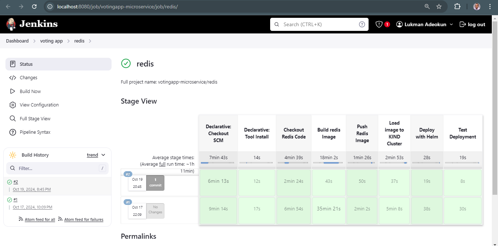

```md
# Redis Component - Voting App Microservice

This repository contains the Redis component of the Voting App microservice. The Redis service is used as an in-memory data store to temporarily store votes before they are synchronized with the PostgreSQL database by the worker-service.

## Table of Contents

- [Overview](#overview)
- [Architecture](#architecture)
- [Getting Started](#getting-started)
- [Configuration](#configuration)
- [Docker](#docker)
- [Kubernetes Deployment](#kubernetes-deployment)
- [Helm Chart](#helm-chart)
- [Monitoring](#monitoring)
- [License](#license)

## Overview

Redis is a key-value, in-memory data store used by the voting-service in this microservice architecture. It allows for fast, temporary storage of votes cast by users. The worker-service syncs the votes from Redis to the PostgreSQL database, ensuring durability.

### Key Features:
- Fast in-memory storage.
- Stores votes temporarily before being synced to PostgreSQL.
- Integrated into a Kubernetes cluster with auto-scaling support.
- Monitored using Prometheus and Grafana.

## Architecture

The Redis service is a critical component of the voting app microservice architecture. It acts as a temporary store for votes submitted by users through the voting-service. Votes are held in Redis until the worker-service processes and syncs them into PostgreSQL.

```text
+----------------+        +-------+         +--------------+
| Voting Service +------>+ Redis  +------->+ Worker-Service|
+--------------- +        +-------+         +--------------+
```

- **Voting-Service**: Collects votes from users and stores them in Redis.
- **Redis**: Temporarily holds votes until the worker-service syncs them with PostgreSQL.
- **Worker-Service**: Syncs the votes from Redis to PostgreSQL.
- **PostgreSQL**: Permanent storage of the votes.

## Getting Started

### Prerequisites

- [Docker](https://www.docker.com/)
- [Kubernetes](https://kubernetes.io/) (with [KIND](https://kind.sigs.k8s.io/))
- [Helm](https://helm.sh/)

### Clone the Repository

```bash
git clone https://github.com/AdekunleDally/voting-app.git
cd voting-app/redis
```

## Configuration

The Redis component can be customized using environment variables defined in the `redis-pod.yaml` and `redis-service.yaml` files.

### Default Environment Variables:

| Variable | Description              | Default Value |
|----------|--------------------------|---------------|
| `REDIS_PORT` | Port for Redis server | `6379`        |
| `REDIS_PASSWORD` | Password for Redis authentication | `""` (empty) |

## Docker

To build and run the Redis container locally using Docker:

### Build Docker Image

```bash
docker build -t lukmanadeokun31/redis .
```

### Run the Docker Container

```bash
docker run -p 6379:6379 lukmanadeokun31/redis
```

## Kubernetes Deployment

The Redis service can be deployed to a Kubernetes KIND cluster using the provided Kubernetes manifest files.

### Deploy Redis to KIND Cluster

```bash
kubectl apply -f redis-pod.yaml
kubectl apply -f redis-service.yaml
```

### Verify Redis Deployment

Check the Redis pods:

```bash
kubectl get pods -l app=redis
```

Check the Redis service:

```bash
kubectl get svc -l app=redis
```

## Helm Chart

The Redis service can  also deployed using the Helm chart included in the redis branch. 

### deploy redis using Helm Chart

```bash
helm install redis ./redis-chart
```

This will deploy  Redis, into the Kubernetes KIND cluster.

## Automated deployment of redis using Jenkins pipeline
* Create a pipeline in the root directory of the redis branch
* Include the relevant stages of deployment in the jenkinsfile
* Build the Jenkins pipeline 



## Monitoring

Redis is monitored using Prometheus and Grafana. A `ServiceMonitor` is configured to collect Redis metrics.

### Prometheus ServiceMonitor

Ensure that Prometheus is installed and set up to scrape Redis metrics. You can view the metrics from Redis at:

```bash
<your-prometheus-url>/targets
```

Grafana dashboards can be set up to visualize the metrics.
  


```

### Explanation:
- **Overview**: Provides a high-level explanation of Redis in the context of the voting app.
- **Architecture**: Explains Redis' role and how it interacts with other services.
- **Getting Started**: Explains how to set up Redis locally and in a Kubernetes cluster.
- **Configuration**: Details how to configure Redis using environment variables.
- **Docker/Kubernetes Deployment**: Provides commands for Docker and Kubernetes deployments.
- **Monitoring**: Explains how to monitor Redis using Prometheus and Grafana.
